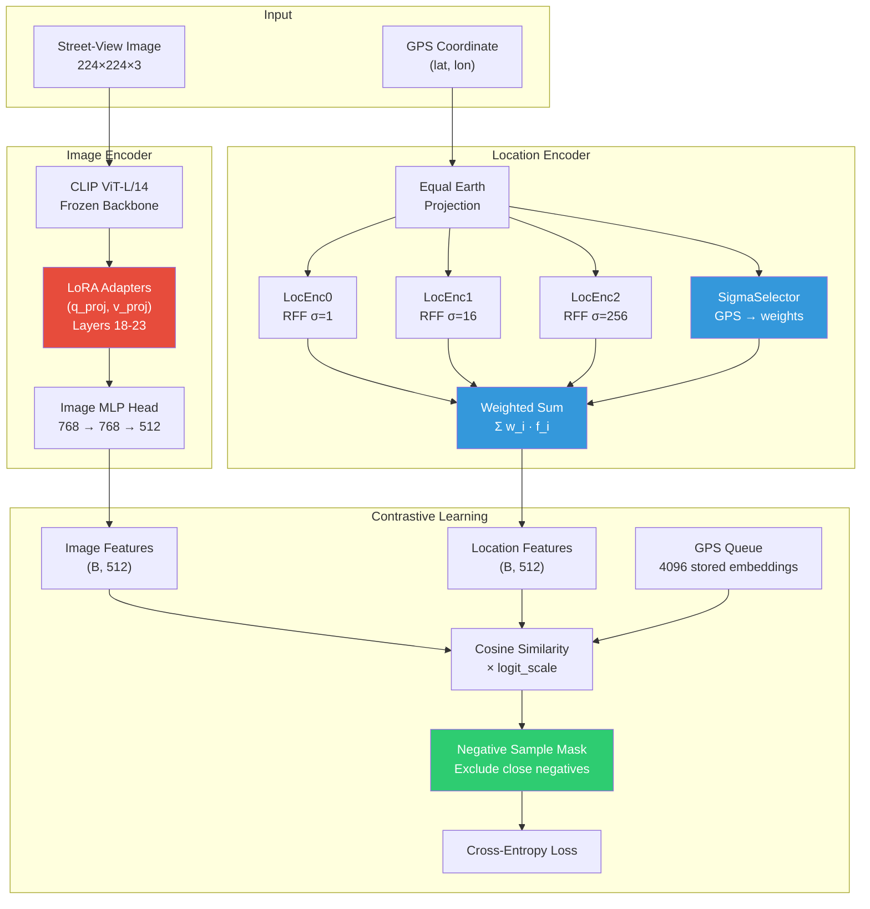
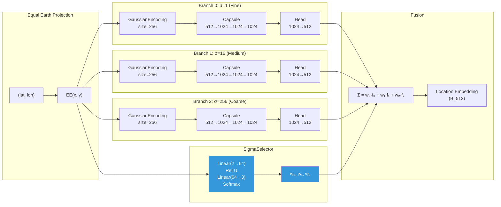
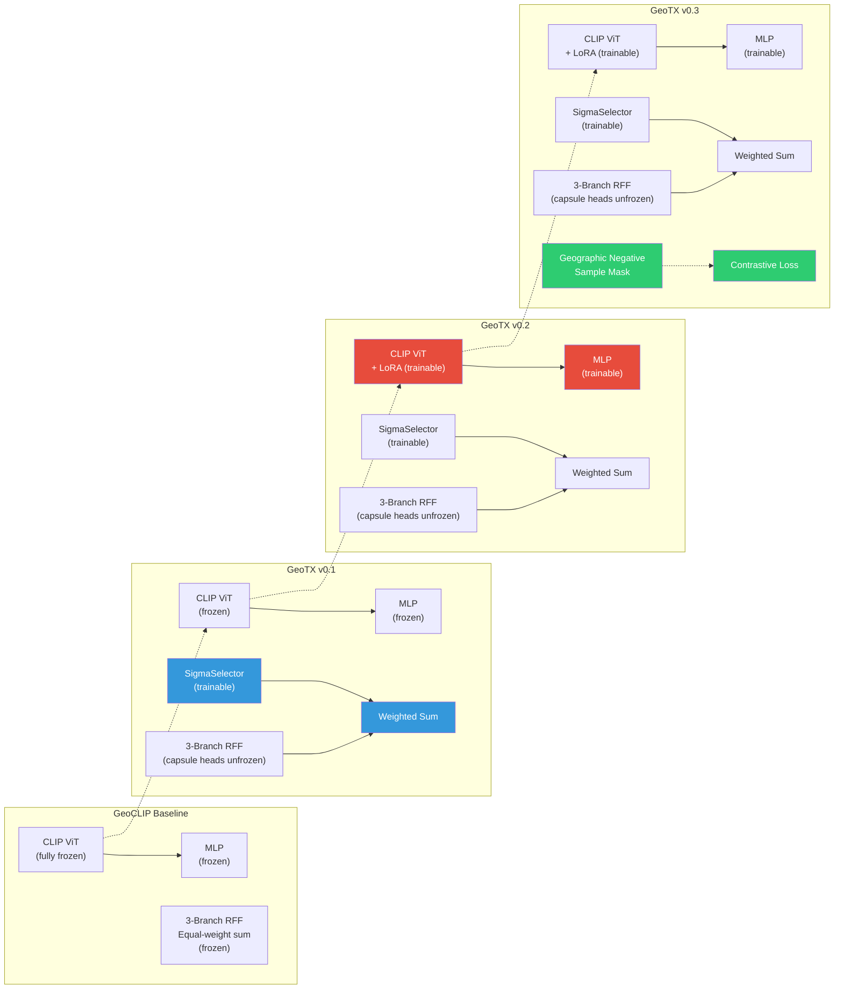

# GeoTX: A Transfer Learning Example of Geo-Locating on StreetView Dataset

## Introduction

This is the course project of Machine Learning (CS3308), based on [GeoCLIP](https://arxiv.org/abs/2309.16020v2) (NeurIPS 2023). For documents of GeoCLIP, see `docs/geoclip`.

Traditional geo-localization models like GeoCLIP achieve high accuracy at thresholds of 1km, 25km, 200km, 750km, and 2500km. However, their training dataset (MP-16) and testing dataset (Im2GPS3k) are dominated by tourist images — landmarks, distinctive architecture, iconic scenery. These images contain strong visual cues that make location recognition relatively straightforward.

Street-view images present a much harder problem: repetitive building facades, generic roads, fewer landmarks, and highly variable lighting/weather. Consequently, GeoCLIP's accuracy degrades significantly on street-view datasets.

**GeoTX** is a transfer-learning pipeline that progressively adapts GeoCLIP to street-view images through three targeted optimizations:

| Version | Components | Key Innovation |
|---------|-----------|----------------|
| **GeoTX v0.1** | SigmaSelector + unfrozen capsule heads | Learnable location-conditioned branch fusion |
| **GeoTX v0.2** | v0.1 + LoRA on CLIP ViT + image MLP | Domain-adaptive visual features via low-rank adaptation |
| **GeoTX v0.3** | v0.2 + Optimized Negative Sampling | Geography-aware contrastive loss |

## Architecture

### Overall Pipeline



**Legend:** Red = LoRA (v0.2), Blue = SigmaSelector (v0.1), Green = Negative Sampling (v0.3)

### Location Encoder Detail: Three-Branch RFF + SigmaSelector

GeoCLIP's LocationEncoder models the Earth's surface as a continuous function using Random Fourier Features (RFF). GPS coordinates are first projected via Equal Earth projection, then encoded through three parallel branches with different spatial-frequency sensitivities (σ = 1, 16, 256):



**Key insight:** The original GeoCLIP sums the three branch outputs equally. SigmaSelector replaces this with a learnable, GPS-conditioned weighted sum, letting the model learn which spatial scale matters most for each geographic region.

### Three-Stage Optimization Evolution



## Testing

See `docs/dev/test.md` for the complete training and evaluation runbook for all three versions.

## Project Structure

```
geo-clip/
├── geoclip/
│   ├── model/
│   │   ├── GeoCLIP.py           # Main model + haversine + negative sampling mask
│   │   ├── image_encoder.py     # CLIP ViT + LoRA + MLP head
│   │   ├── location_encoder.py  # 3-branch RFF + SigmaSelector weighted fusion
│   │   ├── misc.py              # GPS data loading utilities
│   │   └── rff/                 # Random Fourier Features (Gaussian encoding)
│   └── train/
│       ├── train.py             # Original GeoCLIP training loop
│       ├── dataloader.py        # GeoDataLoader + image transforms
│       └── eval.py              # Distance-accuracy evaluation
├── scripts/
│   ├── train_sigma_selector.py      # Train GeoTX v0.1
│   ├── eval_sigma_selector.py       # Evaluate v0.1 vs baseline
│   ├── train_lora.py                # Train GeoTX v0.2
│   ├── eval_lora.py                 # Evaluate v0.2/v0.3
│   ├── train_negative_sampling.py   # Train GeoTX v0.3
│   ├── sample_streetview_subset.py  # Feasibility subset (900/100 split)
│   └── convert_streetview_pano_dataset.py
└── docs/
    ├── dev/              # Design specs for each optimization
    ├── geoclip/          # Original GeoCLIP docs
    └── reproduction/     # Im2GPS3k reproduction logs
```

## Evaluation Metrics

All models are evaluated with Great-Circle Distance accuracy at five thresholds:

| Threshold | What it measures |
|-----------|-----------------|
| 1 km | City-block level precision |
| 25 km | City-scale localization |
| 200 km | Regional recognition |
| 750 km | Country/state level |
| 2500 km | Continental level |

## Acknowledgments

This project builds on [GeoCLIP](https://github.com/VicenteVivan/geo-clip) (NeurIPS 2023) by Vicente Vivanco, Gaurav Kumar Nayak, and Mubarak Shah. The Random Fourier Features implementation originates from Joshua M. Long's [random-fourier-features-pytorch](https://github.com/jmclong/random-fourier-features-pytorch).
