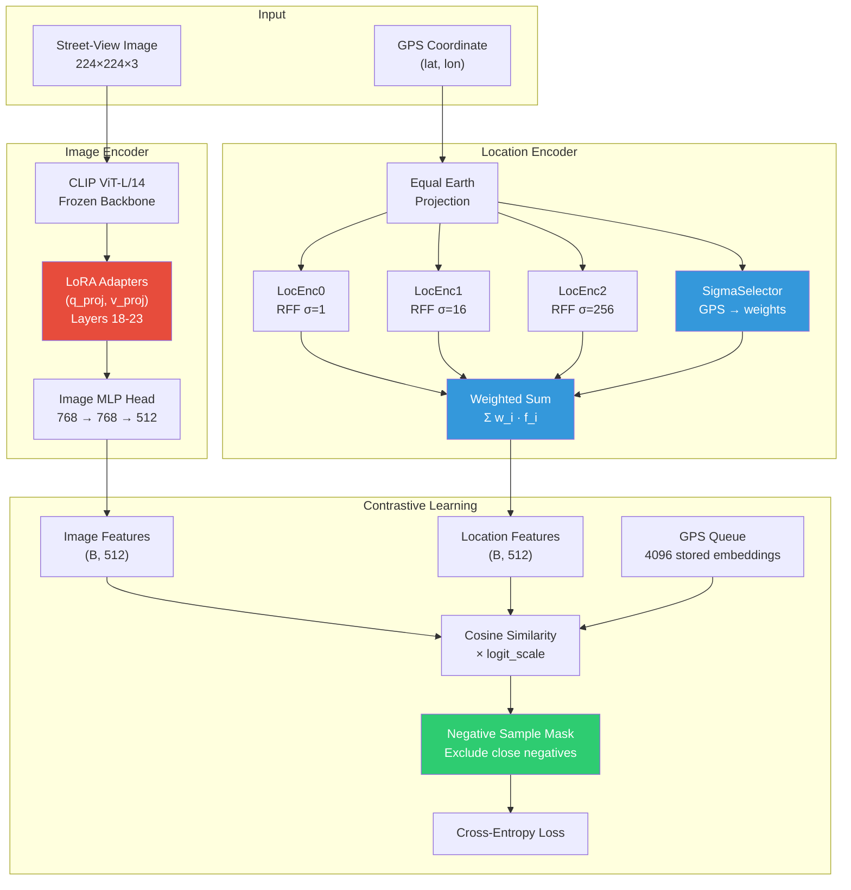
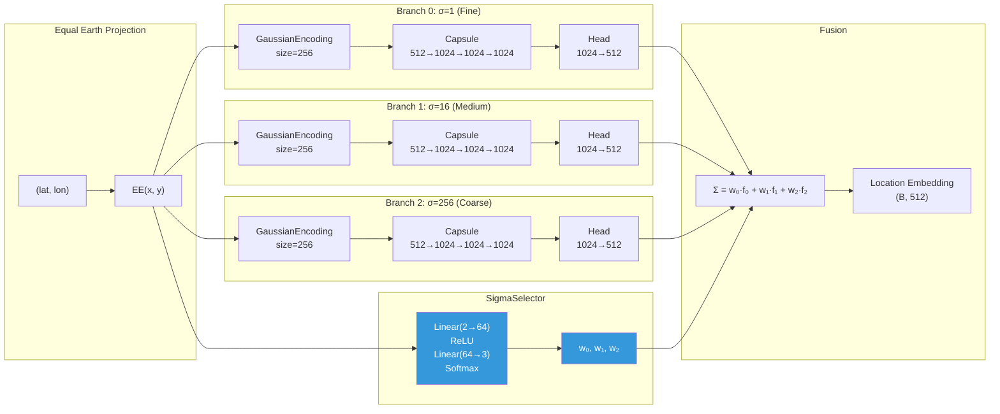
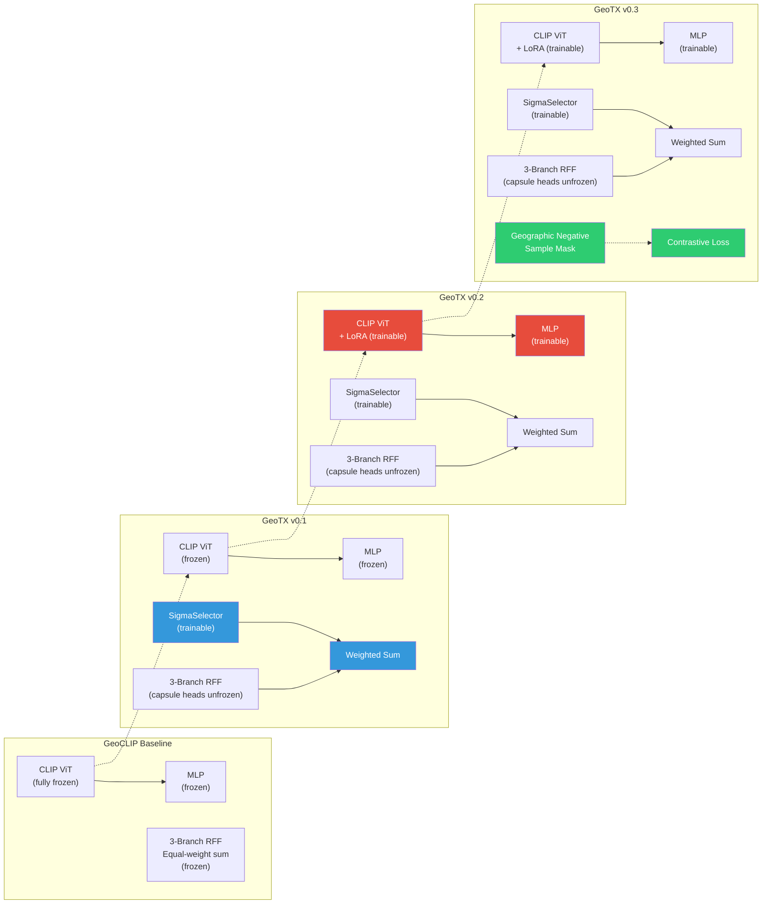

# GeoTX: A Transfer Learning Example of Geo-Locating on StreetView Dataset

## Introduction

This is the course project of Machine Learning (CS3308), based on [GeoCLIP](https://arxiv.org/abs/2309.16020v2) (NeurIPS 2023). For documents of GeoCLIP, see `docs/geoclip`.

Traditional geo-localization models like GeoCLIP achieve high accuracy at thresholds of 1km, 25km, 200km, 750km, and 2500km. However, their training dataset (MP-16) and testing dataset (Im2GPS3k) are dominated by tourist images — landmarks, distinctive architecture, iconic scenery. These images contain strong visual cues that make location recognition relatively straightforward.

Street-view images present a much harder problem: repetitive building facades, generic roads, fewer landmarks, and highly variable lighting/weather. Consequently, GeoCLIP's accuracy degrades significantly on street-view datasets.

**GeoTX** is a transfer-learning pipeline that progressively adapts GeoCLIP to street-view images through three targeted optimizations:

| Version | Components | Key Innovation |
|---------|-----------|----------------|
| **GeoTX v0.1** | SigmaSelector + unfrozen capsule heads | Learnable location-conditioned branch fusion |
| **GeoTX v0.2** | v0.1 + LoRA on CLIP ViT + image MLP | Domain-adaptive visual features via low-rank adaptation |
| **GeoTX v0.3** | v0.2 + Optimized Negative Sampling | Geography-aware contrastive loss |

## Architecture

### Overall Pipeline



**Legend:** Red = LoRA (v0.2), Blue = SigmaSelector (v0.1), Green = Negative Sampling (v0.3)

### Location Encoder Detail: Three-Branch RFF + SigmaSelector

GeoCLIP's LocationEncoder models the Earth's surface as a continuous function using Random Fourier Features (RFF). GPS coordinates are first projected via Equal Earth projection, then encoded through three parallel branches with different spatial-frequency sensitivities (σ = 1, 16, 256):



**Key insight:** The original GeoCLIP sums the three branch outputs equally. SigmaSelector replaces this with a learnable, GPS-conditioned weighted sum, letting the model learn which spatial scale matters most for each geographic region.

### Three-Stage Optimization Evolution



## Development

The development and testing documents are in `docs/dev`. Reproduction instructions are in `docs/dev/test.md`.

### SigmaSelector (GeoTX v0.1)

#### Motivation

The original `LocationEncoder` in GeoCLIP uses three RFF branches with σ values of `[1, 16, 256]`, corresponding to fine-grained, medium, and coarse spatial frequencies. The outputs are summed equally: `f_loc = f_0 + f_1 + f_2`. This equal-sum fusion assumes all spatial scales are equally informative for every location on Earth — an assumption that does not hold in practice. Urban canyons benefit from fine-grained features, while rural highways need coarser context.

#### Implementation

`SigmaSelector` is a lightweight neural network that predicts branch weights from GPS coordinates:

```
Input:  Equal-Earth-projected GPS (B, 2)
        ↓
Linear(2, 64) → ReLU → Linear(64, 3) → Softmax(dim=-1)
        ↓
Output: Branch weights (B, 3), row-wise sum = 1
```

The weighted fusion replaces equal-sum:

```
f_loc = Σᵢ wᵢ(location) × fᵢ(location)    where wᵢ sums to 1
```

**Initialization:** The final linear layer is zero-initialized (both weight and bias), so before training the Softmax outputs uniform weights `[1/3, 1/3, 1/3]` — exactly matching the baseline behavior.

**Training strategy:** Only `SigmaSelector` parameters are trainable; all other parameters (ImageEncoder, LocationEncoder capsule backbones, logit_scale) are frozen. Optionally, the `--unfreeze-capsule-head` flag unfreezes each branch's final linear layer (`LocationEncoderCapsule.head`) for additional adaptation.

**Key source files:**
- `geoclip/model/location_encoder.py:45-60` — `SigmaSelector` class
- `geoclip/model/location_encoder.py:82-97` — Weighted fusion in `LocationEncoder.forward()`
- `scripts/train_sigma_selector.py` — Training script

### LoRA on ImageEncoder (GeoTX v0.2)

#### Motivation

While SigmaSelector improves the location-side of the model, the image encoder still relies on a generic CLIP ViT-L/14 pre-trained on internet images. This backbone lacks sensitivity to domain-specific street-view features: regional architectural styles, road signage types, local vegetation patterns, and pavement textures. Replacing the world knowledge stored in CLIP would be wasteful. Low-Rank Adaptation (LoRA) allows us to inject domain-specific knowledge without catastrophic forgetting.

#### Implementation

LoRA injects trainable low-rank decomposition matrices into the self-attention projections:

```
W' = W + ΔW    where ΔW = A × B,  A ∈ R^(d×r), B ∈ R^(r×d),  r ≪ d
```

**Configuration:**

| Parameter | Value |
|-----------|-------|
| Target modules | `q_proj`, `v_proj` |
| Target layers | 18–23 (last 6 of ViT-L/14) |
| Rank (r) | 4 or 8 |
| Alpha | 8 or 16 (= r × 2) |
| Dropout | 0.05 |

Only the last 6 layers are adapted because earlier layers capture low-level features (edges, textures) that transfer well across domains, while later layers encode semantic concepts that need domain alignment.

**Training strategy with differential learning rates:**

| Parameter Group | LR | Reason |
|----------------|-----|--------|
| LoRA adapters (A, B matrices) | 1e-4 | Learning new visual concepts |
| Image MLP (768→768→512) | 1e-4 | Adapting projection to new features |
| SigmaSelector | 5e-5 | Fine-tuning location attention |
| Capsule heads | 5e-5 | Fine-tuning location encoding |

All CLIP ViT backbone weights remain frozen. Mixed-precision training (`torch.cuda.amp`) is used to reduce memory and accelerate iteration.

**Key source files:**
- `geoclip/model/image_encoder.py:22-37` — LoRA injection via PEFT library
- `scripts/train_lora.py` — Training script with freeze/unfreeze logic

### Negative Sampling (GeoTX v0.3)

#### Motivation

After SigmaSelector and LoRA, the model's feature representations are stronger. However, the contrastive loss treats all non-matching pairs as equally "negative," regardless of geographic distance. For geo-localization, this is suboptimal: an image from Shanghai should not be penalized as harshly for confusing its location with Hangzhou (200 km away) as it would be for confusing it with Paris (9,000 km away). The standard InfoNCE loss lacks this geographic prior.

#### Implementation

A negative-sample mask is applied to the logits before the cross-entropy loss, setting geographically-close negatives to `-inf` so they are excluded from the softmax denominator.

Two strategies are supported:

**1. Threshold-based (`--neg-strategy threshold`):**
```
For each anchor i in batch:
    Compute haversine distance d(i, j) for all candidates j
    Mask j if d(i, j) < H    (e.g., H = 200 km)
    Keep anchor i unmasked (it is the positive)
```

**2. Top-K (`--neg-strategy topk`):**
```
For each anchor i in batch:
    Compute haversine distance d(i, j) for all candidates j
    Keep only the K furthest negatives (excluding anchor i)
    Mask all others
```

The mask is applied as: `logits[mask] = -inf`, which zeroes out those positions in the softmax denominator. This ensures the model is only penalized for confusing the true location with genuinely distant alternatives.

**Efficient distance computation:** Pairwise haversine distances are computed on GPU in `geoclip/model/GeoCLIP.py:14-35` using vectorized tensor operations — no Python loops.

**Key source files:**
- `geoclip/model/GeoCLIP.py:14-76` — `haversine_distance()` and `negative_sample_mask()`
- `scripts/train_negative_sampling.py:135-182` — Training loop with mask application

## Quick Testing

```bash
# GeoTX v0.3 (full model) evaluation
python scripts/eval_lora.py --dataset streetview_pano --checkpoint geoclip/model/weights/neg_sampling_weights.pth
```

See `docs/dev/test.md` for the complete training and evaluation runbook for all three versions.

## Project Structure

```
geo-clip/
├── geoclip/
│   ├── model/
│   │   ├── GeoCLIP.py           # Main model + haversine + negative sampling mask
│   │   ├── image_encoder.py     # CLIP ViT + LoRA + MLP head
│   │   ├── location_encoder.py  # 3-branch RFF + SigmaSelector weighted fusion
│   │   ├── misc.py              # GPS data loading utilities
│   │   └── rff/                 # Random Fourier Features (Gaussian encoding)
│   └── train/
│       ├── train.py             # Original GeoCLIP training loop
│       ├── dataloader.py        # GeoDataLoader + image transforms
│       └── eval.py              # Distance-accuracy evaluation
├── scripts/
│   ├── train_sigma_selector.py      # Train GeoTX v0.1
│   ├── eval_sigma_selector.py       # Evaluate v0.1 vs baseline
│   ├── train_lora.py                # Train GeoTX v0.2
│   ├── eval_lora.py                 # Evaluate v0.2/v0.3
│   ├── train_negative_sampling.py   # Train GeoTX v0.3
│   ├── sample_streetview_subset.py  # Feasibility subset (900/100 split)
│   └── convert_streetview_pano_dataset.py
├── docs/
│   ├── dev/              # Design specs for each optimization
│   ├── geoclip/          # Original GeoCLIP docs
│   └── reproduction/     # Im2GPS3k reproduction logs
└── data/
    └── streetview_pano/  # Street-view dataset (images + CSV splits)
```

## Evaluation Metrics

All models are evaluated with Great-Circle Distance accuracy at five thresholds:

| Threshold | What it measures |
|-----------|-----------------|
| 1 km | City-block level precision |
| 25 km | City-scale localization |
| 200 km | Regional recognition |
| 750 km | Country/state level |
| 2500 km | Continental level |

For street-view geo-localization, improvements at **1 km** and **25 km** are the primary targets, as coarse-level performance (200+ km) is already strong from the pre-trained GeoCLIP backbone.

## Acknowledgments

This project builds on [GeoCLIP](https://github.com/VicenteVivan/geo-clip) (NeurIPS 2023) by Vicente Vivanco, Gaurav Kumar Nayak, and Mubarak Shah. The Random Fourier Features implementation originates from Joshua M. Long's [random-fourier-features-pytorch](https://github.com/jmclong/random-fourier-features-pytorch).
